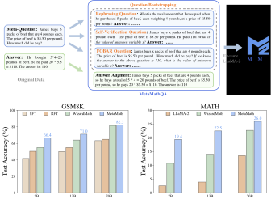

# MetaMath: Bootstrap Your Own Mathematical Questions for Large Language Models

[](CODE_LICENSE)
[](DATA_LICENSE)
[](MetaMath/LICENSE)
[](https://www.python.org/downloads/release/python-390/)

<p align="center">
🤗 <a href="https://huggingface.co/meta-math" target="_blank">HF Repo</a> • 📃 <a href="https://arxiv.org/abs/2309.12284" target="_blank">[MetaMath]</a><br>
</p>

<p align="center" width="100%">
<a ></a>
</p>


## News
- 🔥 A 40K subset of our **MetaMathQA** dataset is now released in the huggingface [MetaMathQA](https://huggingface.co/datasets/meta-math/MetaMathQA/tree/main)!
- 🔥 Our **MetaMath-70B** model slightly outperforms some closed-source LLMs on the GSM8K, including **ChatGPT 3.5**, **Claude Instant 1** and **PaLM 2 540B**!
- 🔥 Our **MetaMath-7B** model achieves  **66.4 pass@1** on the [GSM8k Benchmarks](https://github.com/openai/grade-school-math), which is **11.5** points higher than the SOTA open-source LLM!
- 🔥 Our **MetaMath-7B** model achieves  **19.4 pass@1** on the [MATH Benchmarks](https://github.com/hendrycks/math), which is **8.7** points higher than the SOTA open-source LLM!

| Model | Checkpoint | Paper  | GSM8k | MATH  | License|
| ----- |------| ---- |------|-------| ----- |
| MetaMath-70B-V1.0 | 🤗 <a href="https://huggingface.co/meta-math/MetaMath-7B-V1.0" target="_blank">HF Link</a> |  📃 <a href="https://arxiv.org/abs/2309.12284" target="_blank">[MetaMath]</a>| **82.3**  |  **26.0**	| <a href="https://ai.meta.com/resources/models-and-libraries/llama-downloads/" target="_blank">Llama 2  </a> |
| MetaMath-13B-V1.0 | 🤗 <a href="https://huggingface.co/meta-math/MetaMath-7B-V1.0" target="_blank">HF Link</a> |  📃 <a href="https://arxiv.org/abs/2309.12284" target="_blank">[MetaMath]</a>| **71.0**  |  **22.5** | <a href="https://ai.meta.com/resources/models-and-libraries/llama-downloads/" target="_blank">Llama 2 </a> |
| MetaMath-7B-V1.0 | 🤗 <a href="https://huggingface.co/meta-math/MetaMath-7B-V1.0" target="_blank">HF Link</a>  |  📃 <a href="https://arxiv.org/abs/2309.12284" target="_blank">[MetaMath]</a>| 	 **66.4**  |  **19.4** |  <a href="https://ai.meta.com/resources/models-and-libraries/llama-downloads/" target="_blank">Llama 2  </a>|
                                                                                                                                                                                                                                                                                                   
                                                                                                                                                                                                                                                                                                                                                                             

## Comparing MetaMath with the LLM models.

🔥 Comprehensive Results

| Model               | GSM8k Pass@1 | MATH Pass@1 |
|---------------------|--------------|-------------|
| MPT-7B              | 6.8          | 3.0         |
| Falcon-7B           | 6.8          | 2.3         |
| LLaMA-1-7B          | 11.0         | 2.9         |
| LLaMA-2-7B          | 14.6         | 2.5         |
| MPT-30B             | 15.2         | 3.1         |
| LLaMA-1-13B         | 17.8         | 3.9         |
| GPT-Neo-2.7B        | 19.5         | --          |
| Falcon-40B          | 19.6         | 2.5         |
| Baichuan-chat-13B   | 23.9         | --          |
| Vicuna-v1.3-13B     | 27.6         | --          |
| LLaMA-2-13B         | 28.7         | 3.9         |
| InternLM-7B         | 31.2         | --          |
| ChatGLM-2-6B        | 32.4         | --          |
| GPT-J-6B            | 34.9         | --          |
| LLaMA-1-33B         | 35.6         | 3.9         |
| LLaMA-2-34B         | 42.2         | 6.24        |
| RFT-7B              | 50.3         | --          |
| LLaMA-1-65B         | 50.9         | 10.6        |
| Qwen-7B             | 51.6         | --          |
| WizardMath-7B       | 54.9         | 10.7        |
| LLaMA-2-70B         | 56.8         | 13.5        |
| WizardMath-13B      | 63.9         | 14.0        |
| MetaMath-7B         | **66.4**     | **19.4**    |
| MetaMath-13B        | **71.0**     | **22.5**    |
| WizardMath-70B      | 81.6         | 22.7        |
| MetaMath-70B        | **82.3**     | **26.0**    |


<h2 id="training">Training</h2>

### Supervised fine-tuning

We supervised fine-tune MetaMath-7B with the following hyperparameters:

| Hyperparameter | LLaMA 2 7B |
|----------------|-------------|
| Batch size     | 128         |
| Learning rate  | 2e-5        |
| Epochs         | 3           |
| Max length     | 1024        |
| LR scheduler   | cosine      |


<h2 id="evaluation">Evaluation</h2>

The inference prompt for our MetaMath is:
```
"Below is an instruction that describes a task. Write a response that appropriately completes the request.\n\n### Instruction:\n{instruction}\n\n### Response: Let's think step by step."
```

Thanks for the open source code of [WizardMath](https://github.com/nlpxucan/WizardLM/tree/main/WizardMath) and [RFT](https://github.com/OFA-Sys/gsm8k-ScRel/tree/main). Some of our codes are based on them.

<h2 id="citation">Citation</h2>
Please cite the paper if you refer to our model or code or data or paper from MetaMath.

```
@misc{yu2023metamath,
      title={MetaMath: Bootstrap Your Own Mathematical Questions for Large Language Models}, 
      author={Longhui Yu and Weisen Jiang and Han Shi and Jincheng Yu and Zhengying Liu and Yu Zhang and James T. Kwok and Zhenguo Li and Adrian Weller and Weiyang Liu},
      year={2023},
      eprint={2309.12284},
      archivePrefix={arXiv},
      primaryClass={cs.CL}
}
```
